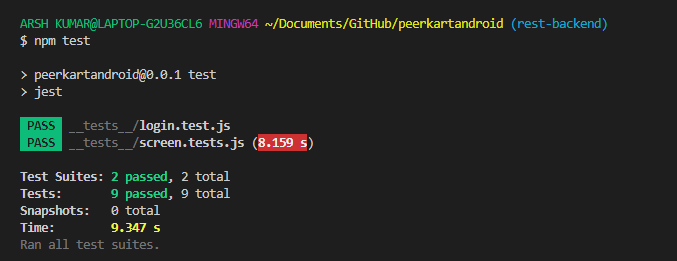

# Test Report

## Unit Tests

Performed some unit tests to check the proper rendering of the screens and its components.

### Test on the rendering of the screens

Wrote some tests in jest inorder to check the proper rendering of the components and screens.

### Test on the functions

Wrote a test code in jest to check if the login function was workind as expected or not.
Basically checked whether the function hits the correct endpoint and the data returned on a successful login is as expected.

#### TEST OUTPUT

